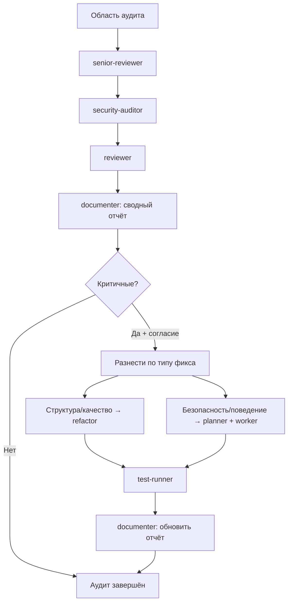

# Skill: аудит проекта

**Назначение:** последовательно вызвать senior-reviewer, security-auditor, reviewer; свести находки в отчёт (documenter); при критических проблемах и согласии пользователя — запустить исправления в том же чате.

---

## Схема



**Фазы 1–4 только чтение/анализ. Фаза 5 — только после явного «да» пользователя.**

Анализ **последовательный**: каждый следующий агент получает краткое резюме предыдущих, чтобы не дублировать и углублять.

---

## Шаг 1: область

```
/audit                        → проект целиком (src/ или корень)
/audit src/services/          → каталог
/audit src/auth.ts            → файл
/audit --since main           → файлы, изменённые относительно main
/audit --since HEAD~10        → последние 10 коммитов
```

Для `--since`: `git diff --name-only [ref]` → список файлов в scope для всех агентов.

Без указания области — основной каталог исходников (`package.json`, `src/`, `app/` или уточнение у пользователя).

---

## Шаг 2: архитектура (senior-reviewer)

**Цель:** структура, дизайн, архитектура.

**Чеклист:** SOLID, слои, паттерны, границы модулей, связность, циклы, god-модули, масштабирование, переусложнение.

**Формат находок:** группы Critical / High / Medium / Low с ID (A1, A2, …).

---

## Шаг 3: безопасность (security-auditor)

**Цель:** уязвимости и риски.

**Контекст:** краткое резюме архитектурных находок (фокус на auth, API).

**Чеклист:** auth/authz, валидация, XSS/инъекции, секреты в коде, OWASP, API (rate limit, CORS), ПДн, зависимости, утечки в ошибках.

**Формат:** S1, S2, … по уровням серьёзности.

---

## Шаг 4: качество кода (reviewer)

**Цель:** качество, сопровождение, техдолг.

**Контекст:** резюме архитектуры + безопасности (меньше дублей).

**Чеклист:** DRY, сложность/длина функций, вложенность, имена, ошибки, мёртвый код, покрытие тестами, TypeScript any, комментарии.

**Формат:** Q1, Q2, … по уровням.

---

## Шаг 5: агрегация серьёзности

Перед documenter собери все находки, посчитай critical/high/medium/low.

**Health score (0–10), ориентир:**
- старт 10  
- critical: −2 каждый (макс суммарно −6)  
- high: −0.5 (макс −3)  
- medium: −0.1 (макс −1)  
- не ниже 0, округление до 1 знака  

---

## Шаг 6: сводный отчёт (documenter)

**Путь к файлу отчёта:**

```javascript
config = readJSON(".cursor/config.json")

auditsEnabled = config.documentation.enabled.audits
auditsPath    = config.documentation.paths.audits

if (auditsEnabled && auditsPath) {
  reportFile = `${auditsPath}/YYYY-MM-DD-{scope-slug}-audit.md`
} else {
  workspacePath = config.workspace.path
  reportFile = `${workspacePath}/audits/YYYY-MM-DD-{scope-slug}-audit.md`
}
```

Передай `reportFile` documenter. В отчёте: executive summary, таблица по категориям и серьёзности, критичные с локациями и фиксами, high/medium/low, матрица приоритетов, next steps (ссылки на `/refactor`, `/implement`).

---

## Фаза 5: исправления (только по согласию)

**Условия:** есть critical **и** пользователь явно подтвердил.

Спроси после отчёта: краткий список critical, «Начать исправление? (y/n)», **дождись ответа**.

**Корзина A — структура/качество:** refactor + затем test-runner (+ debugger до 3 раз).

**Корзина B — безопасность/поведение:** planner (план по пунктам) → для задач: worker → test-writer → test-runner (+ debugger) → при необходимости security-auditor.

После фиксов: documenter обновляет отчёт секцией «Remediation Applied».

**Не автофиксить:** только high/medium/low в отчёте; крупный редизайн; vendor-код.

---

## Область и глубина

| Scope | Глубина |
|-------|---------|
| Файл | максимально детально |
| Модуль | детально |
| Большой каталог | баланс |
| Весь проект | обзор + углубление в критичные 20–30% (auth, API, домен) |
