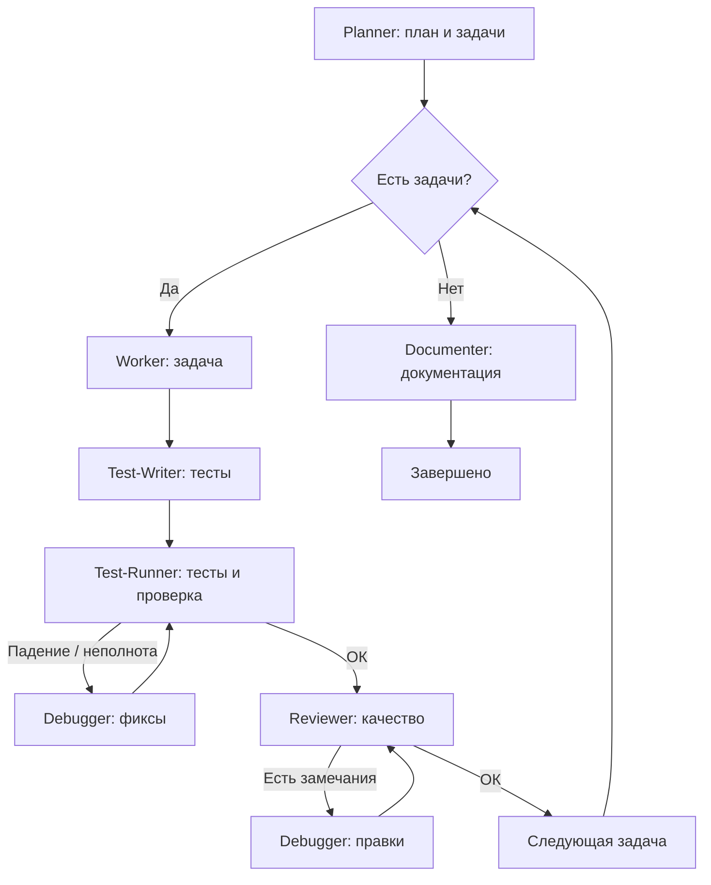

# Skill: оркестрация

**Назначение:** провести полный цикл разработки — от плана до документации с автоматическим исправлением ошибок.

## Архитектура workflow



## Как работает

### Фаза 1: планирование

1. Вызови **planner** с полным описанием задачи  
2. Planner создаёт:
   - workspace: `.cursor/workspace/active/orch-{id}/`
   - план: `workspace/plan.md` или файл пользователя
   - метаданные: `progress.json`, `tasks.json`, `links.json`
3. Planner возвращает ID оркестрации  

### Фаза 2: загрузка оркестрации

**Конфиг:**
```javascript
config = readJSON(".cursor/config.json") || defaultConfig
workspacePath = config.workspace.path
```

**Состояние:**
```javascript
orchestrationId = userInput || findLatestActive()
workspaceDir = `${workspacePath}/active/${orchestrationId}`

progress = readJSON(`${workspaceDir}/progress.json`)
tasksState = readJSON(`${workspaceDir}/tasks.json`)
links = readJSON(`${workspaceDir}/links.json`)

planContent = read(links.plan)
taskIds = extractTaskIds(planContent)
```

### Фаза 3: цикл по задачам

**КРИТИЧНО:** пройди **все** задачи из плана.

Для **каждого** task id:

**Перед стартом задачи:**
```javascript
if (tasksState[taskId]?.status === "completed") continue

tasksState[taskId] = {
  id: taskId,
  status: "in-progress",
  startedAt: now()
}
write(`${workspaceDir}/tasks.json`, tasksState)

updateTaskInPlan(links.plan, taskId, "🔄 In Progress")

updateJSON(`${workspaceDir}/progress.json`, {
  currentTask: taskId,
  lastUpdated: now()
})
```

**Внутри задачи:**

1. **Реализация** — **worker**, дождаться результата  
2. **Тесты** — **test-writer**, дождаться результата  
3. **Линт + тесты + верификация** — **test-runner**  
   - при сбое или неполноте: **debugger** → снова **test-runner**, **не более 3 попыток**  
4. **Ревью** — **reviewer**  
   - при проблемах: **debugger** → снова **reviewer**, **не более 3 попыток**  
5. **Статус задачи** после успеха test-runner и reviewer:

```javascript
tasksState[taskId] = {
  ...tasksState[taskId],
  status: "completed",
  completedAt: now(),
  filesChanged: result.filesChanged,
  testsRun: testResult.total,
  testsPassed: testResult.passed
}
write(`${workspaceDir}/tasks.json`, tasksState)

updateTaskInPlan(links.plan, taskId, "✅ Completed")

updateJSON(`${workspaceDir}/progress.json`, {
  tasksCompleted: progress.tasksCompleted + 1,
  currentTask: null,
  lastUpdated: now()
})
```

### Фаза 4: финализация

После всех задач:

```javascript
updateJSON(`${workspaceDir}/progress.json`, {
  status: "documenting",
  lastUpdated: now()
})

reportFile = callDocumenter({
  orchestrationId: progress.id,
  planFile: links.plan,
  tasksState: tasksState
})

updateJSON(`${workspaceDir}/links.json`, {
  report: reportFile
})

updateJSON(`${workspaceDir}/progress.json`, {
  status: "completed",
  completedAt: now(),
  reportFile: reportFile
})

move(
  `${workspacePath}/active/${orchestrationId}`,
  `${workspacePath}/completed/${orchestrationId}`
)
```

## Важные правила

### Последовательность
- Жди завершения субагента перед следующим  
- Передавай контекст по цепочке  
- Веди состояние на всём протяжении  

### Ошибки
- Повтор с debugger при сбоях  
- **Не более 3 попыток** на этап (тест / ревью)  
- Если лимит — отчитайся пользователю и спроси  

### Лимиты задач
- **Рекомендуется не больше 10 задач** за один цикл  
- Если больше — выполни первые 10, отчитайся, спроси про продолжение  
- Следи за контекстом; при нехватке — сохрани прогресс и спроси пользователя  

### Учёт прогресса
- Веди список выполненных / оставшихся  
- После каждой задачи: «Задача 3/7»  
- В конце — сводка  

### Контекст
- Каждый субагент получает сводку предыдущих шагов  
- Debugger — конкретные ошибки  
- Documenter — полную картину  

## Пример ответа пользователю

Пользователь: `/orchestrate Build user authentication with email/password and OAuth`

```markdown
Запускаю полный цикл для этой задачи.

**Задача:** …

### Фаза 1: планирование
[planner → список задач]

### Фаза 2: цикл
**Задача 1/5:** …
- worker → test-writer → test-runner → [при необходимости debugger] → reviewer → …
- ✅ задача 1

…

### Фаза 3: документация
[documenter]

### Итог
✅ Все задачи  
✅ Тесты  
✅ Ревью  
✅ Документация  
```

## Повторы

### Тест / верификация
```
test-runner → FAIL → debugger → test-runner
  (макс 3)
  иначе — пользователь
```

### Ревью
```
review → проблемы → debugger → review
  (макс 3)
  иначе — пользователь
```

## Триггеры

- `/orchestrate [задача]`
- «Оркестрируй [X]»
- «Полная реализация [Y]»

## /implement vs /orchestrate

| /implement | /orchestrate |
|------------|--------------|
| Один компонент | Целая фича |
| Один файл | Несколько модулей |
| Без плана | Нужна декомпозиция |
| Быстро | Комплексно |

## Возможности

1. Автопланирование  
2. Test-writer на задачу  
3. Debugger при сбоях тестов/ревью  
4. Ворота качества: test-writer → test-runner → reviewer  
5. Прогресс по задачам  
6. Итоговая документация  

## Критерии успеха

- Все задачи из плана реализованы  
- Тесты проходят  
- Ревью пройдено  
- Критерии приёмки подтверждены test-runner  
- Документация создана  

## Замечания

- Skill заменяет оркестрацию на хуках  
- Всё в одном чате  
- Пользователь может вмешаться  
- Debugger только при реальных проблемах  
- Лимит 3 попыток снимает бесконечные циклы  
