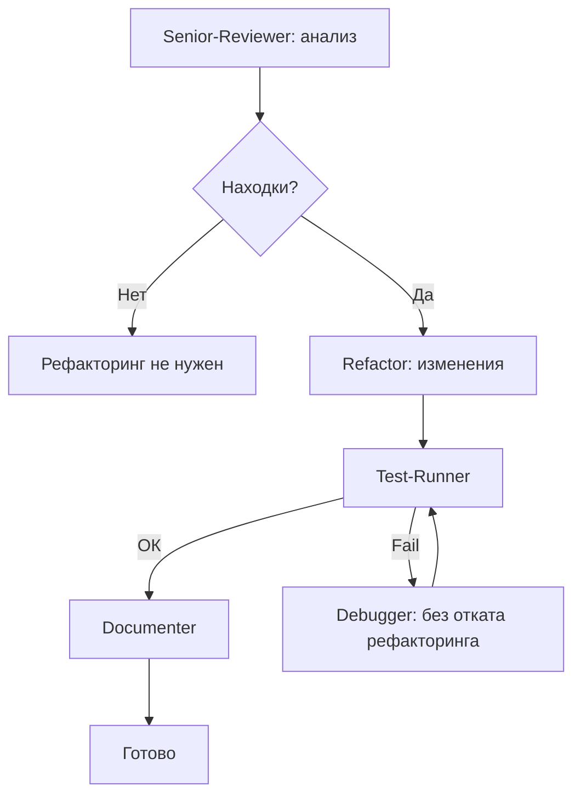

# Skill: workflow рефакторинга

**Назначение:** безопасный цикл senior-reviewer → refactor → test-runner → documenter с проверкой тестами.

---

## Схема



**Макс повторов:** 3 на этап. Иначе — пауза и отчёт пользователю.

---

## Шаг 1: область

Из ввода пользователя:

```
/refactor src/utils/helpers.ts              → файл
/refactor src/services/                     → каталог
/refactor "Extract auth logic from UserService" → по смыслу
/refactor                                   → недавний git diff
```

Если неясно — уточни файлы, каталог или цель.

---

## Шаг 2: предусловие — нужны тесты

**КРИТИЧНО:** до рефакторинга убедись, что для целевого кода есть тесты.

```
Если тестов нет:
  → Предупреди: «Нет тестов для [область]. Рефакторинг рискован.
     Лучше: /implement с тестами, потом /refactor.»
  → Спроси: продолжать? или сначала тесты?
  → Если продолжить — осторожно, поведение не менять
```

---

## Шаг 3: анализ (senior-reviewer)

Только анализ, без правок кода.

**Нужно получить:**
- запахи с указанием файла и диапазона строк
- тип рефакторинга на каждый запах
- приоритет: High / Medium / Low
- зависимости между запахами

**Категории запахов:**

| Запах | Признаки | Приём |
|-------|----------|--------|
| Длинная функция | >30 строк, много обязанностей | Extract Function |
| God class | >300 строк, всё в одном | Extract Class |
| Дубли | одна логика в 2+ местах | Extract + reuse |
| Глубокая вложенность | >3 уровней | Guard clauses |
| Feature envy | чужие данные чаще своих | Move Method |
| Data clump | одни и те же 3+ параметра | Extract Object |
| Primitive obsession | строки/числа вместо типов | Value Objects |
| Switch по типу | длинный if/switch | Polymorphism |
| Shotgun surgery | одно изменение — много файлов | Move, консолидация |

**Ожидаемый формат от senior-reviewer:** краткий отчёт с целями и рекомендациями.

---

## Шаг 4: рефакторинг (refactor)

Передай агенту refactor полный вывод анализа.

**В промпте:**
- все цели из senior-reviewer
- исходная область / файлы
- «В порядке приоритета»
- «Остановись, если нужна смена поведения»
- «Не добавляй фич, новых тестов и не меняй публичный контракт без необходимости»

**Refactor должен:** прочитать code-quality-standards, применять малыми шагами, после шагов проверять компиляцию, описывать до/после.

---

## Шаг 5: проверка (test-runner)

- линтер по изменённым файлам
- тесты (весь suite или релевантная часть)
- регрессий нет

**При падении тестов:**
```
debugger с промптом:
  - какой тест упал
  - какой рефакторинг
  - ограничение: «Чини падение БЕЗ отката рефакторинга.
    Возможны импорты, переименования, перенос — обнови тесты.»
→ снова test-runner, макс 3
```

---

## Шаг 6: документация (documenter)

После зелёных тестов — краткий отчёт о сессии рефакторинга (scope, что сделано, метрики, что сознательно не трогали).

---

## Рефакторинг vs переписывание

| Сигнал | Рекомендация |
|--------|--------------|
| Сложно, но тесты зелёные | Рефакторинг |
| Нет тестов | Сначала тесты (/implement) |
| Неверная логика и бардак | Сначала баги, потом рефакторинг |
| Нужна другая архитектура | Обсудить с пользователем, возможно /orchestrate |
| Меняется публичный API | Это не «чистый» рефакторинг — /orchestrate |

---

## Размер области

| Область | Файлов | Рекомендация |
|---------|--------|--------------|
| Одна функция | 1 | Идеально |
| Один файл | 1 | Отлично |
| Модуль | 3–5 | Нормально |
| Несколько модулей | 6–10 | Разбить сессии |
| Весь репозиторий | >10 | Сузить scope |

Крупное делить на несколько вызовов `/refactor`.
