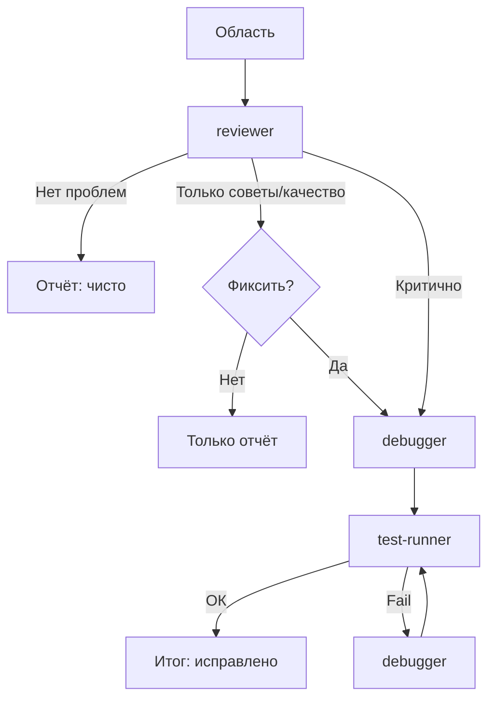

# Skill: workflow ревью

**Назначение:** reviewer → при необходимости debugger → test-runner для точечного ревью.

---

## Схема



---

## Шаги

### Шаг 0 — область

```
/review                     # индексированные (перед коммитом)
/review src/components/     # каталог
/review src/auth.ts         # файл
/review --staged            # только staged
/review --last-commit       # последний коммит
```

По умолчанию: **staged** (`git diff --staged`). Если пусто — **неиндексированные** (`git diff HEAD`). Если пусто — попроси указать файлы.

### Шаг 1 — ревью

**ОБЯЗАТЕЛЬНО: Task с subagent_type="reviewer"**

```
Task(
  subagent_type="reviewer",
  prompt="Проверь: [область/файлы/staged].
  Ищи: баги, безопасность, DRY, SOLID, сложность, имена, ошибки, TypeScript.
  Классификация: Critical / Quality / Suggestion.
  Укажи пути и номера строк."
)
```

Дождись результата. Разбей находки по категориям.

**Нет проблем** → ✅ и стоп.

**Только Quality/Suggestion** → покажи находки, спроси: «Исправить сейчас?» Да → шаг 2. Нет → стоп.

**Critical** → шаг 2 (при большой области можно уточнить у пользователя).

### Шаг 2 — автофикс (условно)

**Только если:** есть critical **или** пользователь согласен чинить quality.

**ОБЯЗАТЕЛЬНО: Task subagent_type="debugger"**

```
Task(
  subagent_type="debugger",
  prompt="Исправь замечания ревью:

  Critical: [список из шага 1]
  Quality (если пользователь согласен): [список]

  Файлы: [список]
  
  Чини только перечисленное. Не рефакторь сверх необходимости. Новых фич не добавляй."
)
```

### Шаг 3 — проверка (если был шаг 2)

**ОБЯЗАТЕЛЬНО: Task subagent_type="test-runner"**

```
Task(
  subagent_type="test-runner",
  prompt="Проверь, что фиксы ничего не сломали.
  Изменённые файлы: [из шага 2]
  Что сделано: [кратко]

  Запусти линтер и тесты."
)
```

При падении тестов → **Task(subagent_type="debugger")** с деталями → снова test-runner. **Макс 3** попытки.

---

## Правила

1. **Сам код не пиши** — только координация  
2. **Файлы сам не правь** — только субагенты  
3. **Каждый шаг — через Task** с верным `subagent_type`  
4. **Перед фиксом quality** — спроси пользователя  
5. **Передавай контекст** между шагами  

---

## Прогресс

После каждого субагента кратко в чат: что смотрели, сколько critical/quality/suggestion, были ли фиксы, итог.

---

## Когда использовать

**Хорошо:**
- перед коммитом
- после фичи, перед PR
- точечная проверка файла

**Не для:**
- обзора всего проекта → `/audit`
- плановой архитектуры → `/refactor`
- новых фич → `/implement` или `/orchestrate`
