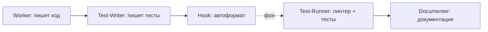

# Skill: простой workflow

**Назначение:** последовательно вызвать worker → test-writer → test-runner → documenter для простых задач.

## Как устроено

### Цепочка: код → тесты → (автофикс) → линт + тесты → документация



1. **Worker** — реализация  
2. **Test-Writer** — тесты (автоопределение стека)  
3. **Hook** (фон) — форматирование (prettier, eslint --fix)  
4. **Test-Runner** — линт + тесты  
5. **Documenter** — документация по путям из config  

Все шаги субагентов — в одном чате. Hook в фоне.

## Пример

Пользователь: `/implement Создай компонент Button с onClick`

Ты:

```markdown
Выполню в четыре шага: код, тесты, проверка, документация.

### Шаг 1: реализация
[Task subagent_type="worker"]

### Шаг 2: тесты
[После worker — Task subagent_type="test-writer"]

### Шаг 3: проверка
[После тестов — Task subagent_type="test-runner"]

### Шаг 4: документация
[После успешных тестов — Task subagent_type="documenter"]

### Итог
Все шаги выполнены.
- Worker: [файлы]
- Тесты: [файлы тестов]
- Тесты: [статус]
- Документация: [файлы]
```

## Правила

1. **Последовательность:** дождись завершения субагента перед следующим вызовом  
2. **Все четыре шага:** worker → test-writer → test-runner → documenter  
3. **Один чат:** всё видно пользователю  
4. **Контекст:** передавай следующему агенту результат предыдущего  

## Схема шагов

```
Шаг 1: worker — описание задачи
  → дождаться результата
  → список созданных файлов

Шаг 2: test-writer
  → «Напиши тесты для: [список из шага 1]»
  → дождаться результата
  → файлы тестов

Шаг 3: test-runner
  → «Запусти тесты для: [файлы шагов 1–2]»
  → дождаться результата
  → проверить успех

Шаг 4: documenter
  → «Задокументируй реализацию: [детали шага 1]»
  → дождаться результата
  → финальное резюме
```

## Триггеры

- `/implement [задача]`
- «Реализуй [X]»
- «Создай [Y] с тестами и документацией»

## Когда НЕ использовать

- **Сложные задачи** — `/orchestrate` (с планированием)  
- **Много подзадач** — `/orchestrate`  
- **Нужны ревью/рефактор в цикле** — полный цикл оркестрации  

## Отличие от полного цикла

| Простой workflow | Полный цикл (/orchestrate) |
|------------------|----------------------------|
| Без планирования | С planner |
| Один проход | Много задач из плана |
| Без ревью | С код-ревью |
| Без циклов debugger | Автофиксы через debugger |
| Быстро | Тщательно |

## Плюсы

- ✅ Быстро для простых задач  
- ✅ Всегда test-writer  
- ✅ Всегда проверка test-runner  
- ✅ Всегда документация  
- ✅ Всё в одном чате  
- ✅ Без оверхеда планирования  

## Примеры задач

**Подходит для /implement:**
- утилита, одна функция
- React-компонент
- один API-эндпоинт
- доработка в существующем файле

**Не подходит (используй /orchestrate):**
- целая система аутентификации
- рефакторинг нескольких модулей
- миграция схемы БД
- сложная фича из нескольких частей  
